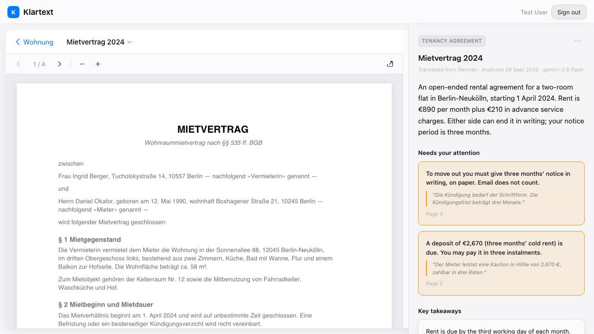
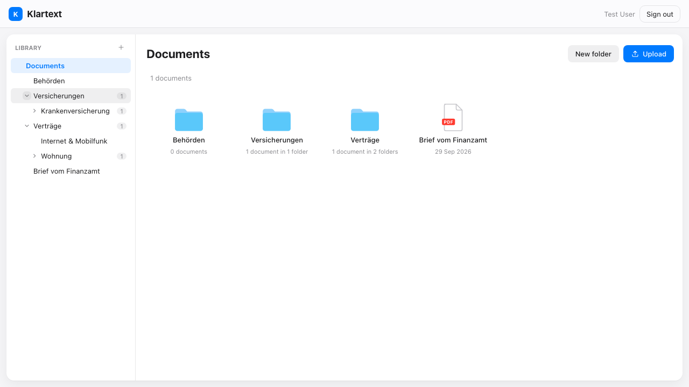
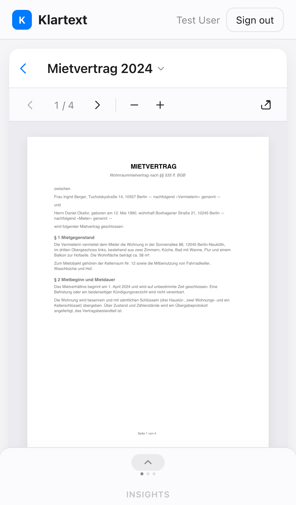

# KlartextDMS

A personal filing cabinet for German paperwork that explains each document in plain English.

Moving to Germany means a flood of contracts and official letters: Mietvertrag, Krankenversicherung, Internetvertrag, Behördenbriefe. Klartext stores them and, for each one, produces an **Extraction**: what kind of document it is, an English summary, the key takeaways (amounts, dates, obligations), and the critical warnings (notice periods, hidden fees, liabilities) that cost you money or rights if you miss them.

[](https://github.com/JohnNooney/KlartextDMS/actions/workflows/firebase-hosting-merge.yml)
[](./LICENSE)

Live at [klartext-host.web.app](https://klartext-host.web.app) — single-user deployment; sign-in is allowlist-gated.



| Library — Documents filed in nested Folders | Reader on a phone — insights sheet resting at peek |
| --- | --- |
|  |  |

Screenshots regenerate deterministically with `pnpm screenshots` — the same seeded-emulator harness as the e2e suite.

## Try it yourself

```sh
git clone https://github.com/JohnNooney/KlartextDMS.git && cd KlartextDMS
pnpm install
pnpm dev:demo
```

Open http://localhost:4200 and sign in with `test-user@test.com` / `test1234`. The seeded Documents open with their Extractions already filled in; `dev:demo` swaps the Guest's AI provider for the same deterministic fixtures, so uploads get a fixture Extraction instead of a Gemini call — no API keys or env vars needed. Plain `pnpm dev` keeps the real Gemini provider.

## Why two apps and an iframe

Klartext is also a sandbox for an enterprise integration problem: embedding a newly acquired Vue product inside a legacy Angular dashboard when the only integration point is an `<iframe>`. The constraint is deliberate, so the project is built as two independent frontends that talk **only** over `window.postMessage`. No Module Federation, no Web Components.

| | Host | Guest |
|---|---|---|
| Stack | Angular (latest stable), SCSS | Vue 3 (Composition API), Vite, TailwindCSS |
| Role | Sign-in, document list, uploads, the frame the Guest renders in | Document viewer + Extraction panel; calls the AI |
| Runs on | Its own port / Firebase Hosting site | Its own port / Firebase Hosting site |

**The Bus.** Everything crossing the iframe is an Envelope `{ v, type, sessionId, payload }`. The Host opens a Session (`INIT_SESSION`) when a Document is clicked; the Guest reports `AI_PROCESSING_STARTED` / `AI_PROCESSING_SUCCESS` / `AI_PROCESSING_ERROR`, and the Host locks the sidebar while processing runs.

**Platform.** Firebase end to end from the first cut: Hosting (two sites), Auth, Storage for Document bytes, Firestore for metadata and Extractions, and Firebase AI Logic (Gemini) called from the Guest with the PDF sent directly to the multimodal model. Local development runs against the Firebase emulators. One Extraction per Document is persisted and reused.

Vocabulary (Host, Guest, Document, Extraction, Bus, Envelope, Session) is defined in [`CONTEXT.md`](./CONTEXT.md); use those terms in code, issues, and docs.

## Status

Working end to end: sign-in, folder library, uploads, the reader, and persisted Extractions run against the emulators locally and on Firebase Hosting in production. Feature work proceeds through the phased issues indexed in [`docs/spec.md`](./docs/spec.md); pick from open issues labelled `ready-for-agent` with no open blockers.

## Repository layout

```
apps/host           Angular dashboard — sign-in, library, PDF view, Guest iframe (:4200)
apps/guest          Vue 3 insights panel rendered in the Host's iframe (:5173)
packages/theme      shared Apple-style design tokens (CSS vars → SCSS / Tailwind)
packages/bus-contract  the { v, type, sessionId, payload } Envelope contract
packages/firebase-config  shared Firebase web config + emulator endpoints
scripts/            deterministic emulator seed (admin SDK) + fixture PDFs/Extractions
emulator-data/      committed emulator snapshot loaded via --import
CONTEXT.md          domain glossary
docs/adr/           architecture decision records
docs/deployment.md  hosting topology and per-Environment Peer Origins
docs/development.md contributor internals — e2e wiring, App Check tokens, port notes
```

## Local development

```sh
pnpm install
pnpm dev          # Host :4200 + Guest :5173 + Auth/Firestore/Storage emulators (seeded)
pnpm dev:demo     # same, but the Guest serves fixture Extractions instead of calling Gemini
pnpm test         # unit/smoke suites across apps and packages
pnpm build        # build both apps
pnpm seed         # regenerate emulator-data/ from scripts/seed.mjs
pnpm emulators    # full emulator suite incl. Hosting emulator (:5050/:5055)
pnpm e2e          # e2e build, then Playwright under firebase emulators:exec (seeded)
pnpm screenshots  # regenerate docs/screenshots/*.png
```

Contributor internals — the e2e Environment wiring, App Check debug tokens, toolchain and port notes — live in [`docs/development.md`](./docs/development.md).

## Working on this repo

- Issues and specs: GitHub Issues via the `gh` CLI, see [`docs/agents/issue-tracker.md`](./docs/agents/issue-tracker.md).
- Agent conventions: [`AGENTS.md`](./AGENTS.md).

## License

[MIT](./LICENSE)
